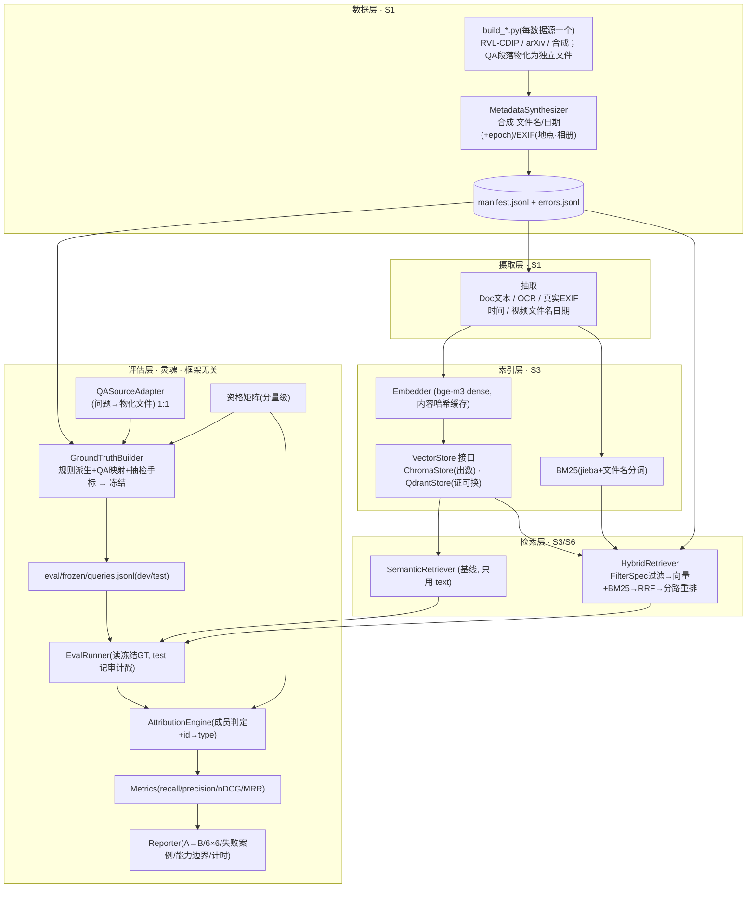

# 架构设计:个人 NAS 多模态文件检索 —— 检索质量与评估(一期)

| 项 | 内容 |
|---|---|
| 版本 | v0.3(Draft,结构化评审 + 决策落地) |
| 日期 | 2026-06-27 |
| 负责人 | li-kezhou |
| 依据 | [PRD v0.2](PRD.md) |
| 目的 | 把 PRD 落成可实现、可测试、可复现、可扩展的系统结构;明确组件边界、**数据契约**、关键决策与理由 |

> v0.3 修订要点(结构化评审结论 + 用户拍板):① **语义 GT 用"段落物化为独立文件(1 问题=1 文件)"+ 半自动映射 + 抽检手标**,S2 前先做 10 条映射探针(阻断项处置);② reranker **统一 sentence-transformers CrossEncoder**(弃 FlagEmbedding,单后端);③ 冻结产物路径统一 `eval/frozen/queries.jsonl`;④ **报告侧诚实产出硬化为输出契约**;⑤ 日期物化 epoch、复杂过滤口径标注;⑥ **依赖锁版 + jieba 入环境 + 装包冒烟门禁**;⑦ test 运行加**可审计戳**;⑧ EXIF `album` 保留并标注"二期预留"。

---

## 1. 架构目标与原则(从 PRD 推导)

| 目标 | 来源 | 架构含义 |
|---|---|---|
| **评估是一等公民,且系统无关** | PRD 主轴 / G1 / FR-6 | 评估层只依赖 `Retriever` 接口 + **冻结的** GT/矩阵,不 import 框架;GT 在 S2 一次派生并锁死 |
| **基线 vs 混合可同集对比** | G2 / S3→S6 | 两检索器实现同一 `Retriever`,评测代码零差异跑两者 |
| **关键零件可替换** | NFR / I12 | **只把 `Retriever`、`VectorStore` 升正式接口**;Embedder/Reranker/OCR/数据源为单实现薄封装/模块,A/B = 改一处实例化 |
| **本地、数据不出门** | NFR | 全本地;无闭源云调用 |
| **可复现** | NFR | manifest/eval 内容哈希 + 固定种子 + **依赖锁版** + 结果快照;浮点不确定下只断言 ranked **名次** |
| **诚实可归因** | I9 / §6.1 | 资格矩阵(分量级)显式数据资产;GT 派生与归因机器可执行;合成字段全程标注;**报告诚实产出有输出契约** |
| **窄而深,不过度工程** | I9 | 抽象预算集中在评估主线;不为二期功能预铺接口(YAGNI) |

**贯穿原则**:依赖倒置、单一职责、小文件高内聚(<400 行)、不可变领域模型、显式错误处理。

---

## 2. 架构总览(分层)



> **三条不变量**:① L5 评估层只依赖 `Retriever` 接口 + 冻结产物,不 import 框架;② GT 在 S2 派生后**锁死**,评估期只读;③ **媒体/视频(真负例类)照常进索引**(否则 precision 压测失效),仅在 GT 派生与归因处被矩阵判真负例。

---

## 3. 核心架构决策(ADR,带理由)

- **AD-1 GT 构建期派生、评估期只读**。`GroundTruthBuilder.derive()` 在 **S2** 由 `manifest + 资格矩阵 + 查询结构化条件 + QA映射 + 抽检手标`合并产出 `positive_ids`,写入 **`eval/frozen/queries.jsonl`** 并入 `eval_hash`;评估期 `EvalRunner/Metrics` **只读冻结值,绝不重算**;`verify_repro` 在 `manifest_hash` 未变时断言重算一致、不一致即报错。*理由*:落实"GT 跑前锁死"。

- **AD-2 LlamaIndex 当原语库,不做编排**。只用其 reader / node parser / BM25Retriever 等**离散原语**;**融合(RRF)与重排自己手写**。防腐边界 = **node→file_id 翻译**:索引时以 manifest `id` 作 Node 稳定主键,适配层聚合并翻译回 `file_id`,评估层只见 `file_id`。

- **AD-3 查询自带结构化条件,基线不得读**。`HybridRetriever` 用 `structured` 过滤,`SemanticRetriever` **只投影 `text`**;加**契约测试**(structured 置空/打乱跑基线,断言结果不变)。NL→条件解析器列扩展点,v1 不做。

- **AD-4 Qdrant 本期只证明可替换**。交付 `VectorStore` 接口 + `ChromaStore`(**所有评测数字用它**)+ `QdrantStore` 适配 + **契约测试**(同向量同查询两实现一致),**不**真迁移。"零改业务"仅对 `upsert/query/等值+数值范围 filter` 成立;复杂过滤在 manifest 层(AD-9)。

- **AD-5 资格矩阵 = 分量级、驱动 GT 派生**。矩阵存 `supported_components(file_type)→set`;每查询有 `required_components`(由类别 + 已填 `structured` 字段推出)。**资格规则**:类型 T 对查询 q 可作正例 ⟺ `required_components(q) ⊆ supported(T)` 且文件实际匹配。GT 派生即据此筛选;**归因退化为成员判定** `ranked_id ∈ frozen_positives ? TP : FP`。

  | file_type | supported_components |
  |---|---|
  | 照片 | {time, type, filename, location} |
  | 视频 | {time, type, filename} |
  | 证件/学习/笔记 | {time, type, filename, semantic} |
  | 媒体 | {}(纯噪声,恒真负例) |

- **AD-6 分段计时分两类**。`IndexingTiming{corpus_load, ocr, extract, embed_batch, upsert}`(S1/S3 一次性);`RetrievalTiming{parse, embed, vector_search, metadata_filter, bm25, fuse, rerank, sort}` per-query,字段 `Optional[float]`,基线不经过的阶段填 `None`(Reporter 显 N/A)。口径用 `time.perf_counter`;`cProfile` 仅离线。

- **AD-7 可复现 + 锁版 + 审计**。L1 评估可复现(从冻结 `manifest+queries` 重跑,`eval/frozen/` 入 git);L2 语料重建尽力而为。SHA-256 对规范化 manifest 元数据(key 排序、UTF-8、逐行 hash 汇总,不含二进制)。**`pip freeze`/`conda env export` 在 S0 末产 lock 文件入 git(NFR-3 版本锁定的落地)**。`run_snapshot{manifest_hash, eval_hash, 库精确版本, 线程数, seed}`。**CPU 浮点不确定 → 只断言 ranked 名次一致**(分数容差)。`pipelines/verify_repro.py` 重跑断言、失败非零退出。**test 运行审计戳**:`EvalRunner` 对 `split='test'` 的每次运行追加 `{时间戳, eval_hash, git commit}` 到 `run_snapshot.test_runs`(只记录、不硬锁),使"test 跑了几次"可审计(诚实纪律 C-2)。

- **AD-8 融合 = RRF(k=60)**。`structured 过滤产生候选域 → 向量 top-N 与 BM25 top-N 各自召回 → RRF 合并(score=Σ 1/(60+rank)) → 分路重排 → top-M`。免归一化、对量纲不敏感、可解释。Config `fusion:{method:rrf, k_rrf:60}` 单一真源。

- **AD-9 复杂过滤在 manifest 层 + 日期物化 epoch**。`FilterSpec`(字段 + op∈{eq,in,range,substr} + AND)。子串/区间/跨字段由 `HybridRetriever` 先在 manifest 上裁候选 `id` 集(对应 `metadata_filter` 计时,**报告如实标注"manifest 层过滤,非向量库原生"**),再在子集上跑 BM25/向量。**所有日期字段在 manifest 生成期物化 `*_epoch` int 旁路字段**;`domain/match.py` 的 `range` 只吃 epoch、对 `None`/月精度日期显式分支(不落字符串比较)。

---

## 4. 组件分解

| 层 | 组件 | 职责 | 关键签名 / 产物 |
|---|---|---|---|
| 数据 | `build_<source>.py`(模块) | 某来源产出统一 `FileRecord`;**QA 集把段落/版面物化为独立 .txt 文件**并写 `qa_links` | `→ Iterable[RawRecord]` |
| 数据 | `MetadataSynthesizer` | 合成文件名/日期(+epoch)/EXIF(地点/相册),写 `synthetic_fields` | `enrich(raw) -> FileRecord` |
| 数据 | `CorpusBuilder` | 按配方配比汇总 → manifest;**断言每被查 type_label 候选 ≥ `MIN_CANDIDATE_POOL`**(反推门禁,不足即报错) | `build() -> Manifest` |
| 摄取 | 抽取模块(doc/ocr/exif/video) | 文档抽文本;扫描 OCR;读真实 EXIF 时间;视频读文件名/日期 | `extract -> FileRecord(text/extract_status)` |
| 索引 | `Embedder` | bge-m3 **dense**;**embedding 按 manifest 内容哈希磁盘缓存**(让 dev 循环可用) | `embed(list[str]) -> list[vec]` |
| 索引 | `VectorStore`(接口) | 向量持久化 + **基础** `FilterSpec`(eq/in/range)近邻查询;复杂 op 见 AD-9 走 manifest 层 | `upsert / query(vec,k,filter)` |
| 索引 | `LexicalIndex` | BM25(jieba + 文件名分词),候选裁剪 | `search(terms,k,candidate_ids=None)` |
| 检索 | `Retriever`(接口:Semantic/Hybrid) | 查询→排序 `file_id`(≥K_MAX) | `search(Query,k) -> RetrievalResult` |
| 检索 | `Reranker` | 仅 `text≠null` 候选重排(CrossEncoder) | `rerank(query, text_cands) -> ranked` |
| 评估 | `CapabilityMatrix` | `supported_components`/`required_components`/`eligible` | 纯函数 |
| 评估 | `QASourceAdapter` | 物化 QA 集 `(问题, 物化文件)` → `Query + positive_ids(gt_source=dataset_qa)`,**1:1** | S2 |
| 评估 | `GroundTruthBuilder` | 三路合并(规则派生 + QA映射 + 抽检手标)派生 `positive_ids` 并冻结 | `derive(...) -> frozen` |
| 评估 | `EvalDataset` | 加载/均衡校验/分层 split/冻结 | `freeze / by_split` |
| 评估 | `EvalRunner` | 跑 retriever(读冻结 GT);test 记审计戳 | `run(Retriever, split) -> [RetrievalResult]` |
| 评估 | `Metrics` | recall/precision/nDCG/MRR + support + CI(纯函数) | TDD 优先 |
| 评估 | `AttributionEngine` | 成员判定 TP/FP + `id→type` → 6×6 | `attribute(result, frozen_pos, id_to_type, matrix)` |
| 评估 | `Reporter` | **输出契约(必出)**:A→B、按类别、6×6、`q6_breakdown`、`failure_by_category`、`top_failures`(Top-3)、`capability_statement`、计时 | `report(...) -> md/json` |
| 横切 | `StageTimer` / `Config` | 计时;路径/模型/k/配方/矩阵/分词/split阈值/`MIN_CANDIDATE_POOL`/`rerank_candidate_n`/版本 | 单一真源 |

**HybridRetriever 流程(伪代码级)**:
```
cand = manifest.filter(FilterSpec from query.structured)        # AD-9, 计 metadata_filter(标注:manifest层)
vec  = vector_store.query(embed(query.text), N, base_filter)    # 计 vector_search
lex  = lexical.search(tokenize(query.text/filename), N, cand)   # 计 bm25
fused = rrf_merge(vec, lex, k=60)                               # AD-8, 计 fuse
text_c, meta_c = split(fused by text!=null)
ranked = merge(reranker.rerank(query.text, text_c[:rerank_candidate_n]), meta_c)  # 计 rerank/sort
return aggregate_node_to_file(ranked)[:K_MAX]                   # AD-2 翻译+聚合
```
基线 `SemanticRetriever`:`vector_store.query(embed(query.text), K_MAX)` → node→file 聚合;`structured` 不参与。

---

## 5. 数据契约(核心 Schema)

**FileRecord(`manifest.jsonl`)**
```jsonc
{
  "id": "photo_000123",                 // 稳定主键 = Node 主键
  "rel_path": "corpus/photo/IMG_2307.jpg",   // 相对 config.data_dir(= data/);绝对路径 = data_dir / rel_path
  "file_type": "photo|video|scan|study|note|media",
  "type_label": "invoice|contract|paper|note|...",   // 受控词表(config/type_labels),Q2 用
  "filename": "IMG_2307.jpg",
  "lang": "zh|en",
  "created_at": "2023-07-14", "modified_at": "2023-07-14",
  "created_epoch": 1689292800, "modified_epoch": 1689292800,   // 物化,range 过滤只吃 epoch(AD-9)
  "exif": { "captured_at": "2023-07-14", "captured_epoch": 1689292800,
            "location": "三亚", "album": "旅行" },   // 仅 photo;captured 若真实则抽取,location/album 恒合成
            // album:本期不参与 GT/检索/资格矩阵,为二期相册检索预留(已入 synthetic_fields)
  "text": null,                         // doc/scan/study/note(含物化 QA 段落)为文本;photo/video/media 恒 null
  "extract_status": "ok|ocr_failed|parse_failed|na",
  "qa_links": [ {"dataset":"DuReader","question_id":"...", "materialized": true} ], // 物化文件 1:1 指向本 file
  "source": { "kind": "public|standard_qa|synthetic", "dataset": "RVL-CDIP", "license": "" },
  "synthetic_fields": ["created_at","exif.location","exif.album","filename"]
}
```
> 坏文件**仍进 manifest**(带 `extract_status`)以参与 precision 压测;错误明细另存 `errors.jsonl`(`{rel_path,stage,error_msg}`)。

**Query(`eval/frozen/queries.jsonl`,S2 冻结)**
```jsonc
{
  "qid": "Q4_007", "category": "Q1|...|Q6", "text": "三亚那次旅游的照片",
  "structured": {
    "time_range": { "start_epoch": 1672531200, "end_epoch": 1680307200 } | null,  // 绝对、半开 [start,end)
    "type": "invoice" | null,            // ∈ type_labels 受控词表,与 FileRecord.type_label 精确相等
    "filename_substr": "Q3" | null,      // 大小写不敏感 + NFC 归一 子串包含(共用 domain/match.py)
    "location": "三亚" | null,
    "semantic_terms": ["深度学习"]       // 仅对 text≠null 文件有效
  },                                     // 分量间 AND;required_components = 非空字段集合
  "positive_ids": ["photo_000123"],      // S2 冻结,评估期只读
  "gt_source": "derived|dataset_qa|manual",
  "split": "dev|test"                    // S2 分层冻结,入 eval_hash
}
```

**CapabilityMatrix(`config/capability_matrix.yaml`)**:`supported_components: {photo:[...location], video:[time,type,filename], scan/study/note:[...semantic], media:[]}`。

**FilterSpec**:`{ conds:[{field, op∈[eq,in,range,substr], value}], joiner:AND }`;复杂 op 走 manifest 层(AD-9);range 只作用于 `*_epoch`。

**RetrievalResult**:`{ qid, ranked:[(file_id, score)](长度≥K_MAX=10, 按最终名次降序), timing:RetrievalTiming }`。Metrics **只用名次**,不按 score 跨检索器重排。

**MetricResult(报告输出契约)**:
```jsonc
{
  "by_category": {"Qx": {"recall@k","precision@k","ndcg@k","mrr","support":n,"ci?":[lo,hi]}},  // n≥8 报 CI
  "by_type_x_category": "6×6(n<5 仅报原始命中计数 + 标'样本不足')",
  "q6_breakdown": {"nonsemantic": {...}, "with_text": {...}},   // FR-23
  "failure_by_category": {"Qx": "fail_rate(正确文件排名>k 占比)"},  // FR-26
  "top_failures": [{"qid","gt_rank","reason"}],                 // Top-3 最悬殊(FR-26)
  "capability_statement": "能力边界声明文本工件",                 // DoD-5 / C-37
  "aggregate": {...}
}
```
> 领域模型**不可变**;共享匹配语义(日期区间/子串/分词)收敛在 `domain/match.py` 纯函数,**GT 派生与检索侧共用同一实现**(防口径漂移)。

---

## 6. 目录结构

```
NAS_RAG/
├── docs/                      PRD.md · ARCHITECTURE.md
├── config/
│   ├── settings.py            路径/模型/k/配方/fusion/rerank_candidate_n/split阈值/MIN_CANDIDATE_POOL/分词/版本
│   ├── type_labels.py         受控类型词表(枚举)
│   └── capability_matrix.yaml 资格矩阵(分量级)
├── src/nas_rag/
│   ├── domain/                不可变模型 + match.py(日期epoch/子串/分词)+ filters.py(FilterSpec)
│   ├── corpus/                build_*.py(含 QA 物化)· metadata.py · builder.py(候选池门禁)
│   ├── ingest/                doc.py · ocr.py · exif.py · video.py · pipeline.py
│   ├── index/                 embedder.py(缓存)· vector_store/(base·chroma·qdrant)· lexical.py · builder.py
│   ├── retrieval/             base.py · semantic.py · hybrid.py · fusion.py(RRF)· reranker.py
│   ├── eval/                  metrics.py · capability.py · qa_adapter.py · ground_truth.py · dataset.py · runner.py · attribution.py · report.py
│   ├── timing/                profiler.py
│   └── pipelines/             s1_build.py … s6_hybrid.py · s7_real_validation.py · verify_repro.py · probe_qa_mapping.py
├── tests/                     镜像 src;fixtures/(迷你 manifest/矩阵/queries + mock Retriever)
├── data/                      raw/(gitignore)· corpus/(gitignore)· manifest.jsonl · errors.jsonl
└── eval/                      frozen/(queries.jsonl + 哈希,入 git)· queries.draft.jsonl(草稿)
```

---

## 7. 数据流(S0–S7)

```mermaid
sequenceDiagram
  participant Build as CorpusBuilder+合成(+QA物化)
  participant Ext as 抽取(含OCR)
  participant Idx as 索引(Embed缓存/VS/BM25)
  participant Probe as QA映射探针
  participant GT as GroundTruthBuilder+矩阵
  participant Ret as Retriever
  participant Ev as EvalRunner+Attribution+Metrics

  Note over Build,Ext: S1 语料构建 + 摄取(OCR;QA段落物化为独立文件)
  Build->>Ext: FileRecord(含坏文件标记/qa_links)
  Ext->>Idx: text/EXIF → 索引(媒体/视频真负例也索引)
  Note over Probe,GT: S2 评测集 + GT(系统无关,锁死)
  Probe->>GT: 10 条映射探针先验证可行性
  GT->>GT: 规则派生 + QA映射 + 抽检手标 → 候选池门禁 → 分层split → 冻结+哈希
  Note over Idx,Ret: S3 基线(先做耗时探针) / S6 混合(RRF)
  Note over Ev: S4 测量 / S5 诊断
  Ev->>Ret: search(query,K_MAX)（基线→混合）
  Ret-->>Ev: RetrievalResult(file_id, timing)
  Ev->>Ev: 读冻结GT → 成员判定TP/FP → 类别+6×6 + A→B + 失败案例 + 能力边界(test 记审计戳)
  Note over Ev: S7 本期收尾(已确认):真实文件小验证(~10–15,手标GT,复用同管线)
```

---

## 8. 横切关注点

- **配置**:`config/settings.py` 单一真源;`k_values=[1,3,5,10]`、`primary_k=5`、`fusion={rrf,k_rrf:60}`、`rerank_candidate_n≤50`(探针后可降到 ~20)、`MIN_PER_CATEGORY=8`、`MIN_TEST_PER_CATEGORY=2`、`TEST_RATIO=0.2`、`MIN_CANDIDATE_POOL≈30`、分词配置、库版本。
- **错误处理**:边界(下载/解析/OCR)显式 try + 坏文件入 `errors.jsonl` 带 `extract_status`(不静默吞);Reporter 区分"抽取失败致召回失败"与"检索能力致召回失败"(PRD"OCR 修复"诊断线)。
- **测试策略(TDD 优先,尺子先于一切)**:`domain/match`(**日期 epoch 区间/子串/中文分词,含跨年/半开端点/NFC/纯数字文件名如 2307 边界 fixture**)、`metrics`、`capability`(分量子集判定)、`ground_truth`(派生确定性)、`attribution`(TP/FP+6×6+真负例,**小表驱动、最高密度**)**最先 TDD**。`tests/fixtures/` 备~10 文件迷你 manifest + 六类型迷你矩阵 + 手算 GT;**mock `Retriever`** 覆盖归因分支(有资格命中/无资格命中/视频地点分量/媒体误捞)。**基线不依赖 structured** 契约测试。覆盖率 ≥80%,评估核心更高。
- **可复现**:AD-7;**S0 末锁版产 lock 入 git**;`verify_repro.py` 入 README"复现"一节;embedding 内容哈希缓存(让 dev 调参循环可用,非"优化检索")。

---

## 9. 技术选型映射

| 组件 | 实现 | 边界 / 说明 |
|---|---|---|
| Embedder | `BgeM3Embedder`(**dense only**,锁定 sentence-transformers/HuggingFaceEmbedding) | sparse/colbert 列扩展点;一期词法由独立 BM25 承担,避免重叠/归因混淆;**embedding 按内容哈希磁盘缓存** |
| VectorStore | `ChromaStore`(**出数**) + `QdrantStore`(证可换,内嵌 local path) | 接口 + 契约测试;真迁移可选(AD-4) |
| LexicalIndex | BM25(`rank-bm25`)+ **jieba 中文分词 + 文件名分词器**(拆驼峰/下划线/数字串,保留 `2307`) | **jieba 已入 environment.yml**;支持 `candidate_ids` 裁剪 |
| Reranker | **sentence-transformers `CrossEncoder` 加载 bge-reranker-v2-m3**(单后端,弃 FlagEmbedding) | 仅 `text≠null` 候选;`rerank_candidate_n≤50`(CPU,探针后可降);避免与 embedder 双后端版本互踩 |
| 编排/读取器 | LlamaIndex **原语**;融合/重排自写 | 仅在 `index/`、`retrieval/`;评估层不依赖(AD-2) |
| OCR | 决策链 **PaddleOCR → RapidOCR(onnxruntime,装包最稳)→ Tesseract+chi_sim** | **装包性 = S0 冒烟门禁;依赖装入 = S1**;合成票据优先用"直接带 text 的模板"降低 OCR 强依赖 |
| 运行环境 | conda + Python 3.12 | environment.yml **含 jieba、单后端**;**S0 末锁版** |

---

## 10. 扩展点(二期 / 可选,YAGNI:一期接口不为其让步)

| 扩展 | 接入方式 |
|---|---|
| **Qdrant 真迁移** | 已有 `QdrantStore` + 契约测试;真灌全量重跑为可选验证(本期出数仍 Chroma) |
| **CLIP 视觉检索** | 新增 `ImageEmbedder` + 多模态命名空间;增一路视觉召回;**改矩阵照片格属二期,需重新派生并冻结为新版 eval_hash,不在一期锁死集内回改** |
| **视频 ASR/抽帧** | 新增 `VideoContentExtractor` 填 `text`;**矩阵视频 Q4/Q5 升 ✅ 属二期,需重新冻结新版 eval_hash** |
| **NL→FilterSpec 解析器** | `retrieval/query_parser.py`,从"读 structured"切到"解析 text" |
| **bge-m3 sparse/colbert** | 切 FlagEmbedding 后端,作向量召回的 A/B |
| **faithfulness**(本期收尾**可选**) | `eval/` 增生成+判定,复用检索结果 |

> 注:**真实文件小验证不是扩展点**,是本期 In-Scope 收尾(§7 S7、PRD §10)。

---

## 11. 架构风险与权衡

| 风险 / 权衡 | 说明 | 缓解 |
|---|---|---|
| **QA→文件 GT 映射**(原阻断) | SQuAD/DocVQA/DuReader 的"来源"是段落/版面非文件 | 段落**物化为独立文件**(1 问题=1 文件)、`qa_links` 1:1;**S2 前 10 条映射探针**;"免手标"诚实降级为"半自动+抽检手标" |
| 分量级归因复杂度 | TP/FP + 6×6 + Q6 分量 | 派生期筛正例 + 评估期成员判定(AD-5),`attribution.py` 小表驱动 + 最高优先 TDD |
| `structured` 作者标注(AD-3) | 弱化端到端真实性 | 文档明示;基线隔离契约测试 |
| 复杂过滤底层能力不足 + 日期静默错配 | Chroma 无子串、字符串日期比较易错 | FilterSpec + manifest 层 + **日期物化 epoch**(AD-9)+ 边界 fixture |
| OCR 在 Py3.12/CPU/Win 装包脆弱 | 证件 24% 靠 OCR | 回退链 + **S0 装包冒烟门禁** + 合成票据直带 text |
| **CPU 耗时拖慢 dev 调参** | embed/rerank 慢,诱发偷偷缩样本 | **S3 一建索引即做耗时探针** + **embedding 内容哈希缓存** + 据实测降 `rerank_candidate_n` |
| 6×6 单格 n≈2 | 统计无力 | 诚实标"样本不足、只报命中",CI 只在类别聚合(n≥8) |
| CPU 浮点不确定 | "同输入同结果"对分数不成立 | 只断言 ranked 名次 + **依赖锁版**(AD-7) |
| test 反复调参(C-2) | 靠约定 | **审计戳**(记录不硬锁,可审计) |

---

*v0.3 在"评估优先、归因可机器执行、零件按需可换、诚实可复现"四条上对齐 PRD,并处置了结构化评审的阻断与高价值修订;实现顺序 S0→S7,评估核心(match/metrics/capability/ground_truth/attribution)先于检索系统落地。*
